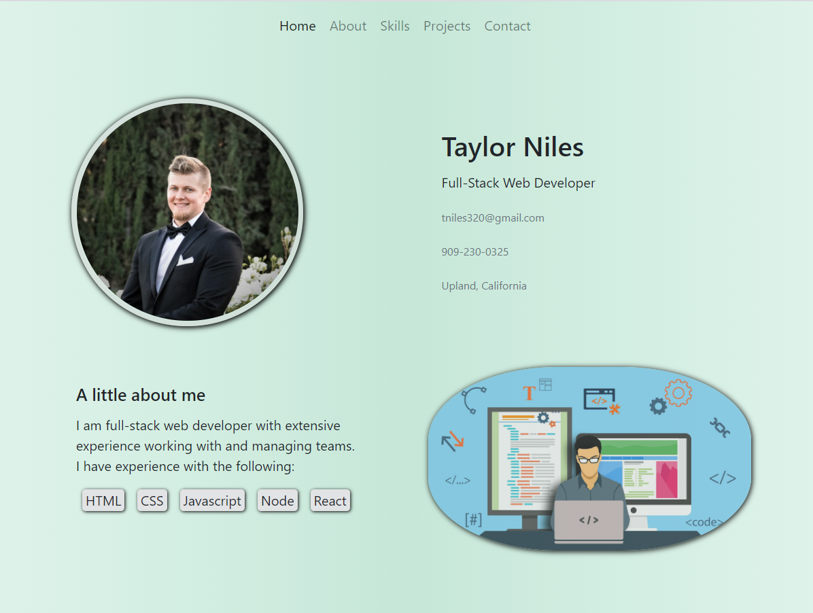
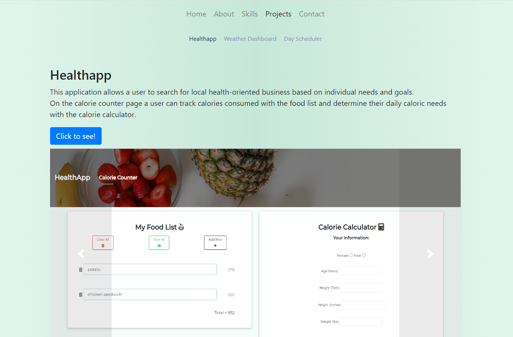
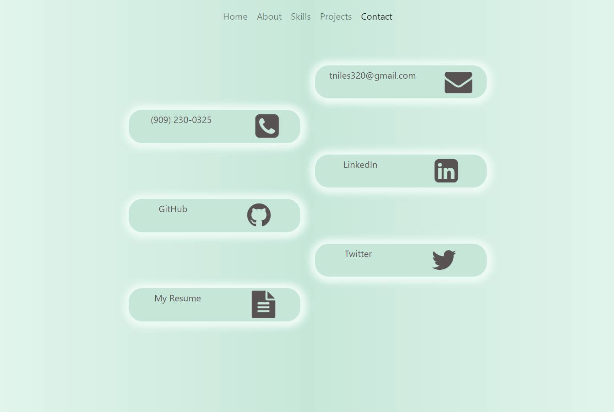

# Portfolio

[Link to my portfolio](https://tniles320.github.io)

My portfolio has 5 pages:
1. Home
    * Includes and image of me and short descirption of my skills
    
2. About
    * TBD
3. Skills
    * TBD
4. Projects
    * Includes 3 projects with images and a description, accessible through an additional nav bar
    
5. Contact
    * Links to personal social media/ websites, phone, and email
    

