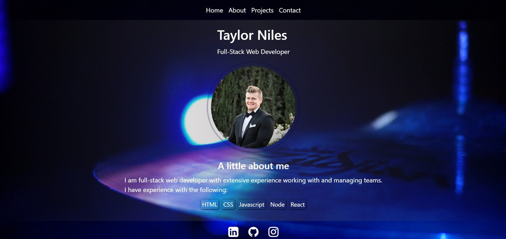

# Portfolio


## Description

My portfolio was created using React and is deployed with Heroku. It uses React Router to display multiple pages and is responsive across multiple devices.

### _Visit this website by clicking the link below_
[Portfolio](https://tniles320.github.io/)



## Table of Contents 

* [License](#license)

* [Contribution Guidelines](#contribution-guidelines)

* [Tests](#tests)

* [Questions](#questions)

## License

This project is licensed under MIT

## Contribution Guidelines

Currently there are no contribution guidelines for this repo.

## Tests

Run the following command in the terminal to run tests:

```
no tests currently for this repo
```

## Questions

If you have any questions regarding this repo, you may contact me at tniles320@gmail.com. To see my other work, follow this link: [GitHub](https://github.com/tniles320/).


